# CVFX-HW1-17

1. Training cycleGAN

   > Dataset — apple2orange

   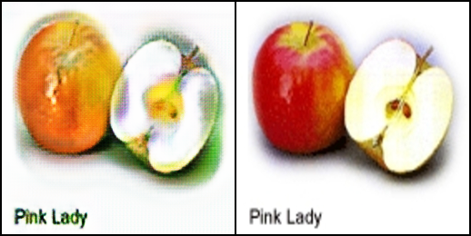

   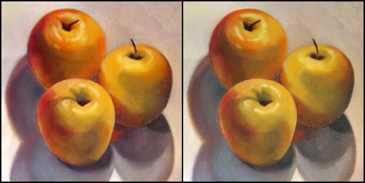

   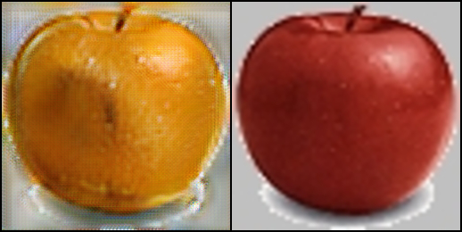

   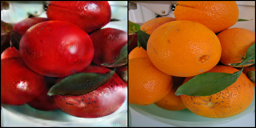

   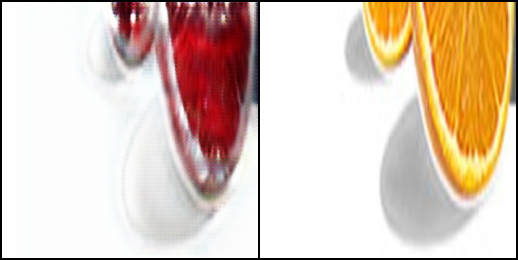

   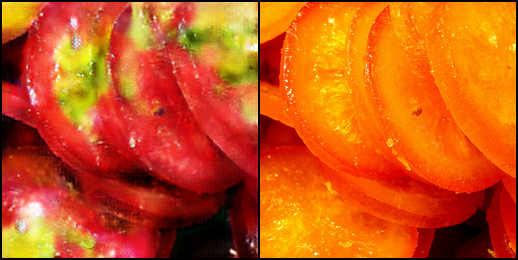

   

2. Inference cycleGAN in personal image

   

   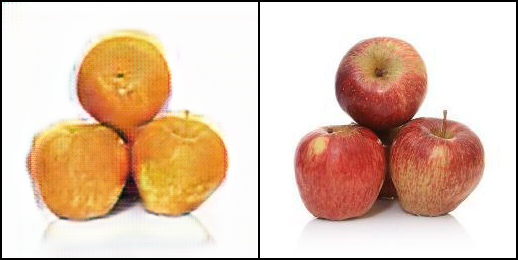

   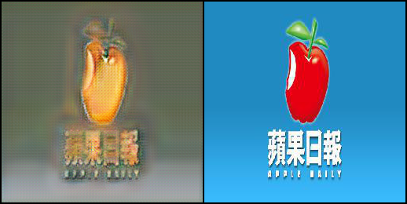

   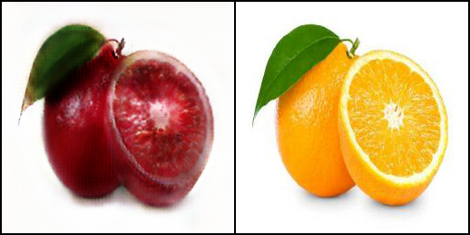

   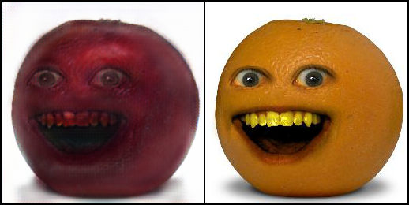

   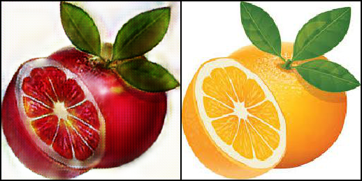

   

3. Compare with other method