# CVFX-HW1-17

1. Training Process 

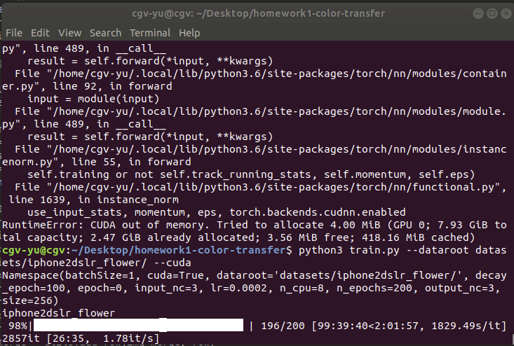

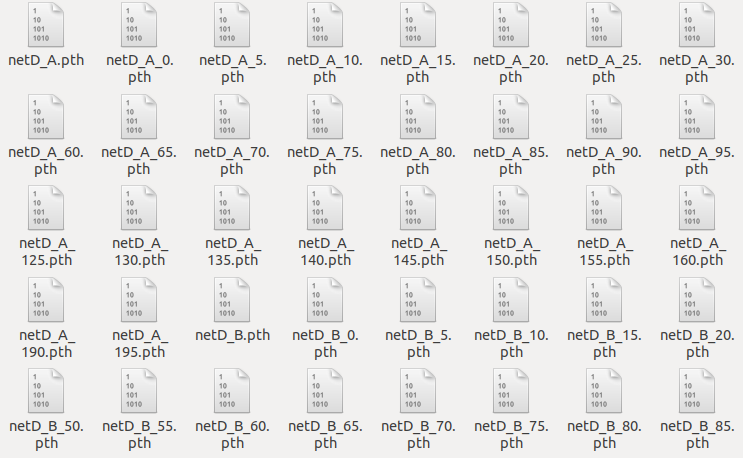

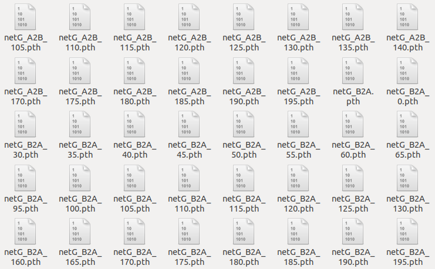

2. Training cycleGAN

> Dataset — apple2orange (The right is the original image, the other one is the generated image)

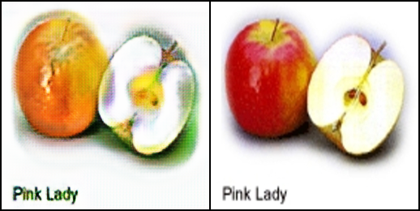

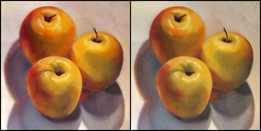

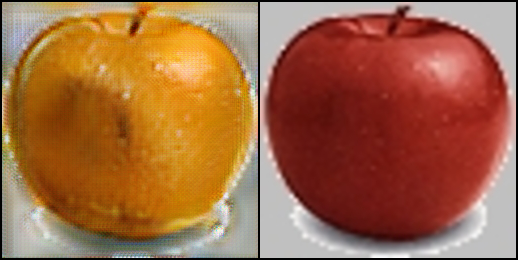

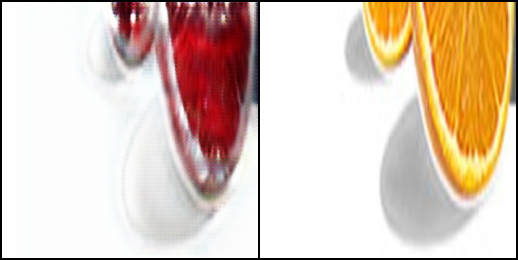

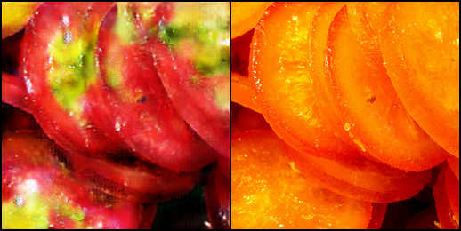

> Dataset — iphone2dslr_flower (The right is the original image, the other one is the generated image)

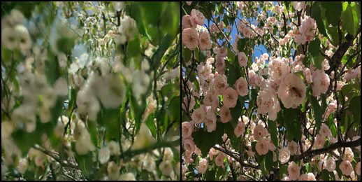

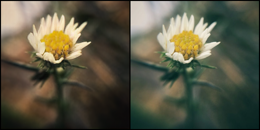

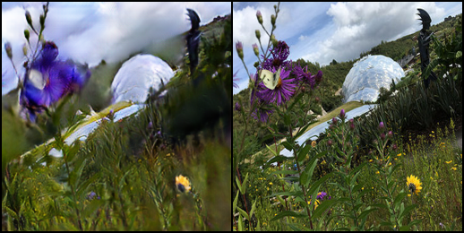

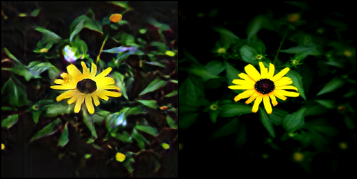

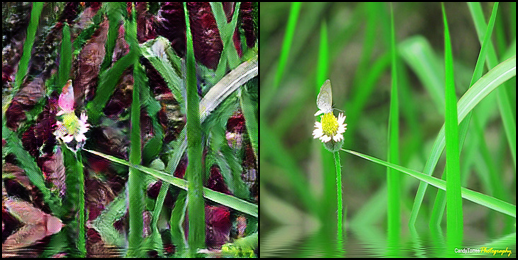

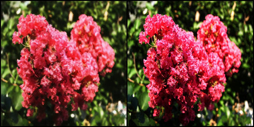

3. Inference cycleGAN in personal image

> Dataset — apple2orange (The right is the original image, the other one is the generated image)

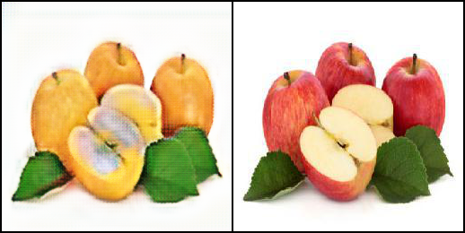

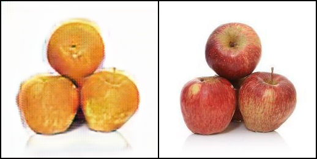

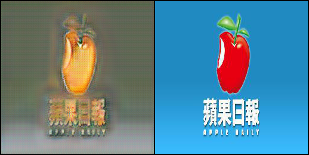

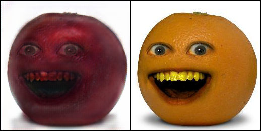

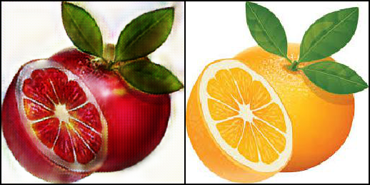

> Dataset — iphone2dslr_flower (The right is the original image, the other one is the generated image)

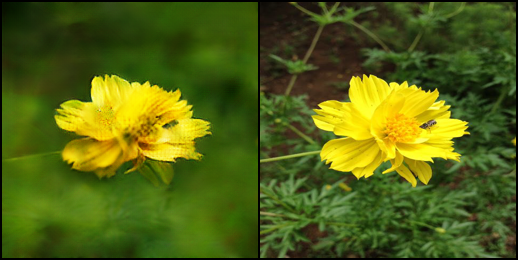

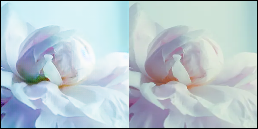

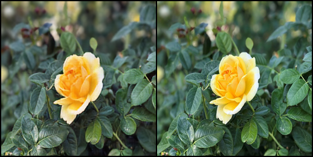

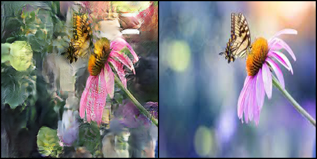

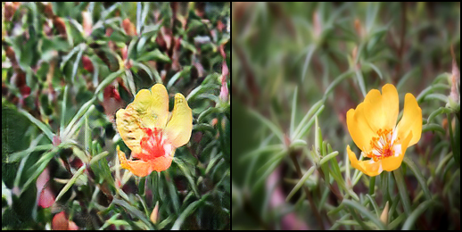

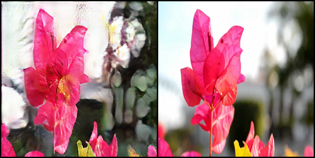

4. Compare with other method
   1. Color Transfer — Super Fast Color Transfer Between Images (https://github.com/jrosebr1/color_transfer)

   > Dataset — apple2orange

   

   

   

   

   

   

   > Dataset — iphone2dslr_flower

   

   

   

   

   

   

   > Analysis

   According to the above results, we think that the effect isn't as good as our expected. Because this algorithm focuses on the performance part, just calculate the mean and standard deviation of the image channels to do the color transfer. However, cycleGAN algorithm consumes more performance and lots of time in the training process, but the generated image is better than the output by this algorithm. 